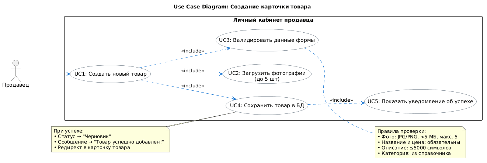
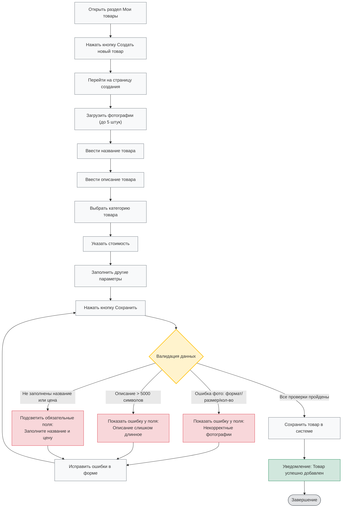

# Требования к функциональности: Создание и публикация карточки товара

##  User Story (Верхнеуровневая постановка)

**Как** продавец,  
**Я хочу** создать и опубликовать карточку товара через Личный кабинет,  
**Чтобы** товар появился в витрине маркетплейса и стал доступен для покупки клиентами.

### Критерии приёмки (Acceptance Criteria)
- Кнопка «Сохранить» активна только при корректном заполнении всех обязательных полей.
- Система валидирует: загрузку до 5 фото (формат JPG/PNG, размер <5 МБ), обязательное заполнение названия и цены (>0), выбор категории из справочника, ограничение описания до 5000 символов.
- При успешной валидации товар сохраняется со статусом `Черновик`, отображается системное уведомление `✅ Товар успешно добавлен!`, происходит автоматический редирект в карточку созданного товара.
- При ошибках валидации отправка формы блокируется, проблемные поля подсвечиваются, выводится текстовое описание ошибки.
- Данные формы сохраняются локально при потере соединения (автосохранение черновика).

---

##  Use Case 

| Параметр | Описание                                                                                                                                                                                                                                                                                                                                                                                                                                                                                                                                                                          |
|----------|-----------------------------------------------------------------------------------------------------------------------------------------------------------------------------------------------------------------------------------------------------------------------------------------------------------------------------------------------------------------------------------------------------------------------------------------------------------------------------------------------------------------------------------------------------------------------------------|
| **ID** | `UC-PROD-001`                                                                                                                                                                                                                                                                                                                                                                                                                                                                                                                                                                     |
| **Название** | Создание и сохранение карточки товара                                                                                                                                                                                                                                                                                                                                                                                                                                                                                                                                             |
| **Основной актёр** | Продавец (авторизованный пользователь ЛК)                                                                                                                                                                                                                                                                                                                                                                                                                                                                                                                                         |
| **Вторичные актёры** | Система валидации, Сервис хранения медиа, База данных каталога                                                                                                                                                                                                                                                                                                                                                                                                                                                                                                                    |
| **Предусловия** | Продавец авторизован, аккаунт активен, открыт раздел «Мои товары»                                                                                                                                                                                                                                                                                                                                                                                                                                                                                                                 |
| **Основной поток** | 1. Продавец нажимает кнопку «Создать новый товар». 2. Система открывает форму создания карточки. 3. Продавец заполняет форму: загружает фото (до 5 шт.), вводит название, описание, выбирает категорию, указывает стоимость, заполняет дополнительные параметры. 4. Продавец нажимает кнопку «Сохранить». 5. Система запускает валидацию всех полей. 6. При отсутствии ошибок система сохраняет товар в БД, присваивает статус `Черновик`. 7. Система отображает уведомление ` Товар успешно добавлен!` и перенаправляет продавца в карточку созданного товара. |
| **Альтернативные потоки** | **A1. Ошибка валидации полей:** Если фото не соответствуют формату/лимитам, не заполнены название/цена или описание превышает 5000 символов - система блокирует отправку, подсвечивает поля красным, выводит список ошибок. Продавец исправляет данные и возвращается к шагу 4.  **A2. Технический сбой/обрыв связи:** При ошибке сервера или сети - система сохраняет введённые данные в локальный черновик, показывает сообщение `Не удалось сохранить. Попробуйте позже`. Продавец может повторить действие после восстановления связи.                                  |
| **Постусловия** | Товар записан в БД, статус установлен, событие зафиксировано в журнале операций ЛК                                                                                                                                                                                                                                                                                                                                                                                                                                                                                                |
| **Бизнес-правила** | • Фото: <=5 шт, форматы JPG/PNG, размер <5 МБ • Название и Цена: обязательные поля, цена > 0 • Описание: <=5000 символов • Категория: выбирается строго из утверждённого справочника маркетплейса                                                                                                                                                                                                                                                                                                                                                                        |

---

## Диаграмма вариантов использования

## Диаграмма процесса создания товара (Mermaid)

